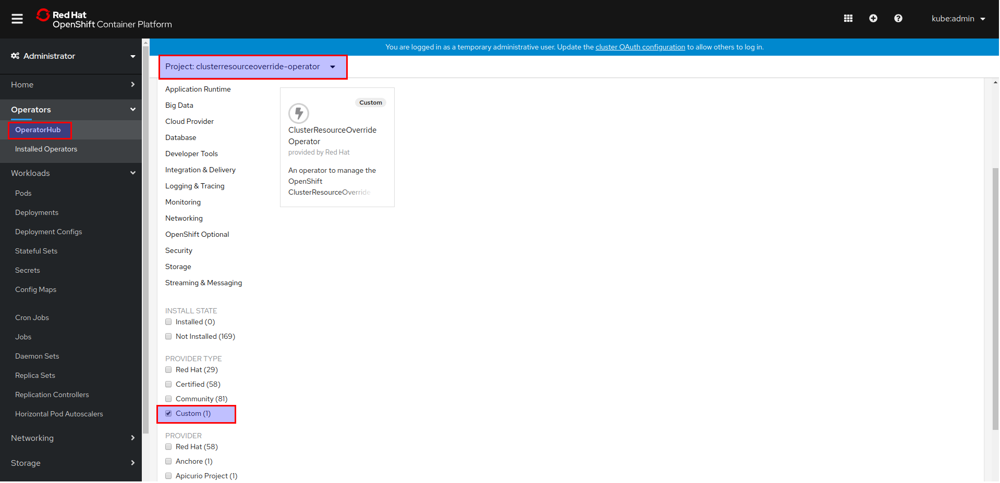
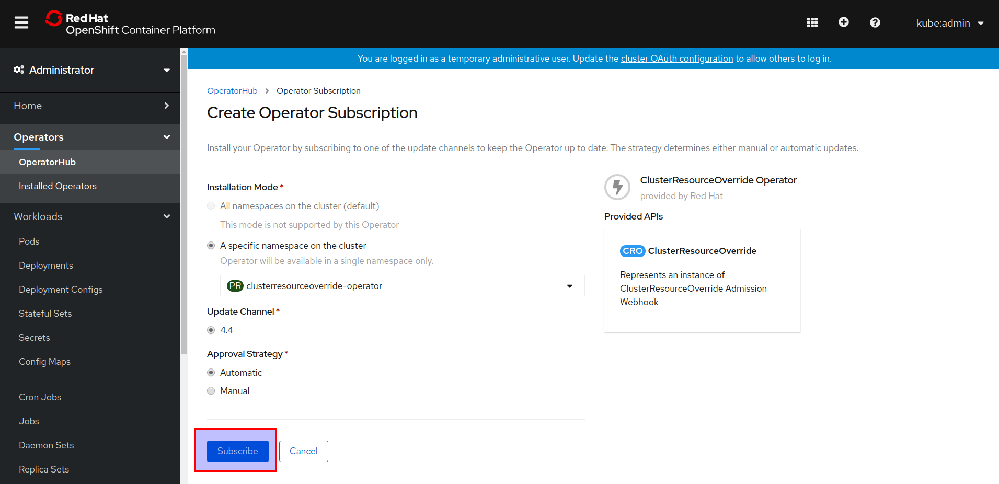
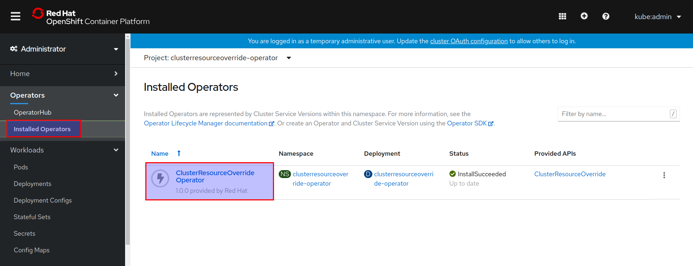
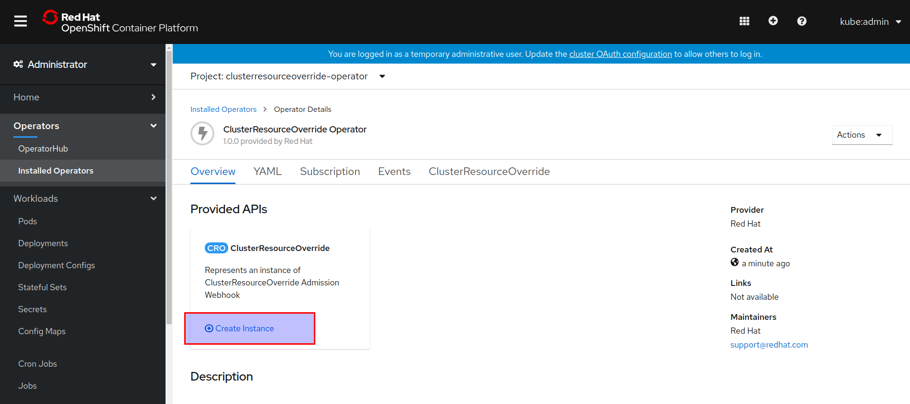
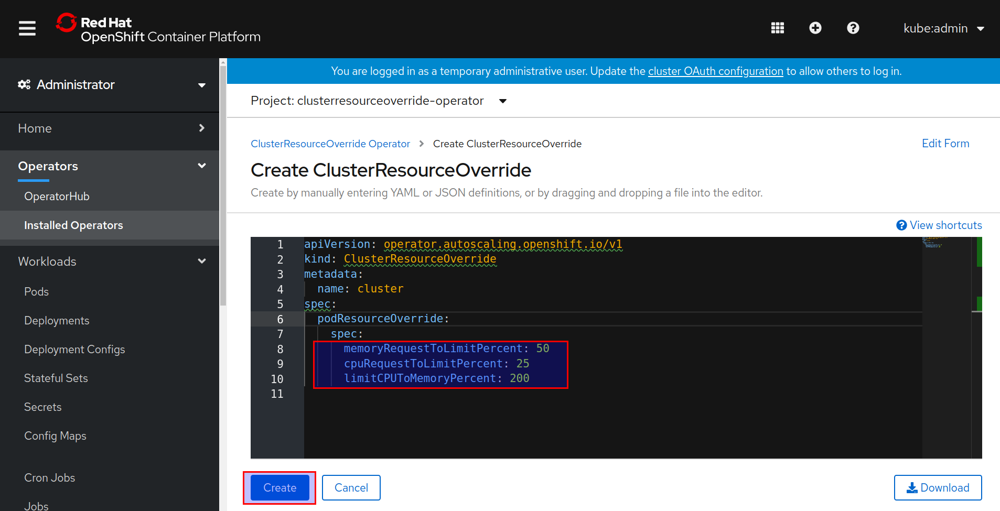

# ClusterResourceOverride Operator 
This document highlights on:
* Install the `ClusterResourceOverride` operator using `OLM`.
* Provision the Admission Webhook using a Custom resource.
* Example of how `Pod` resources are overridden. 

## Install via OLM
This section outlines the steps to install the `ClusterResourceOverride` operator using both OperatorHub UI and command line. 
It also shows how to deploy the Admission Webhook server using a custom resource.  
### Setup Operator Catalog
This will make the operator catalog available to OLM. 
* Create a new namespace.
```bash
cat <<EOF | kubectl create -f -
apiVersion: v1
kind: Namespace
metadata:
  name: clusterresourceoverride-operator
EOF
```

* Create a `CatalogSource` that points to the OLM manifests for the `ClusterResourceOverride` operator.
```bash
cat <<EOF | kubectl create -f -
apiVersion: operators.coreos.com/v1alpha1
kind: CatalogSource
metadata:
  name: clusterresourceoverride-catalog
  namespace: clusterresourceoverride-operator
spec:
  sourceType: grpc
  image: quay.io/redhat/clusterresourceoverride-registry@sha256:932d400cdc885266f07529f396a342d5b98d8a92dba3b76d9dddfdd3b1a294de
EOF
```

Wait for the CatalogSource object to be in `READY` state. One way to make sure is to check the `status` block.
```bash
$ watch kubectl -n clusterresourceoverride-operator get catalogsource clusterresourceoverride-catalog -o jsonpath='{.status.connectionState.lastObservedState}'
READY
```


At this point, you can proceed to install the operator using
 * `OperatorHub UI`
 * Use command line.

#### Install via OperatorHub UI
As highlighted in the snapshots, follow the steps below to install the `ClusterResourceOverride` operator.
* Go to `OperatorHub`
* Select `clusterresourceoverride-operator` Project.
* Select `Custom` for `Provider` type. (`ClusterResourceOverride` operator will appear in the result view)
* Select the `ClusterResourceOverride` operator to install. Click `Install`, it will take you to the `Operator Subscription` page.
* Click `Subscribe` with the default values populated by the UI. 




With the above steps completed, OLM will deploy the `ClusterResourceOverride` operator. Now, we can go ahead and deploy the 
operand (`ClusterResourceOverride` Admission Webhook) by following the steps below:
* Navigate to `Installed Operators` view. 
* Click `ClusterResourceOverride Operator` to navigate to the `Operator Details` view. 
* Click `Create Instance`.
* Change the configuration for the Admission Webhook as you see fit and click `Create` to provision the Admission webhook server.  





#### Install via Command Line
* Create an `OperatorGroup` object. 
```bash
cat <<EOF | kubectl create -f -
apiVersion: operators.coreos.com/v1
kind: OperatorGroup
metadata:
  name: clusterresourceoverride-operator
  namespace: clusterresourceoverride-operator
spec:
  targetNamespaces:
    - clusterresourceoverride-operator
EOF
```

* Create a `Subscription` object.
```bash
cat <<EOF | kubectl create -f -
apiVersion: operators.coreos.com/v1alpha1
kind: Subscription
metadata:
  name: clusterresourceoverride
  namespace: clusterresourceoverride-operator
spec:
  channel: "4.4"
  name: clusterresourceoverride
  source: clusterresourceoverride-catalog
  sourceNamespace: clusterresourceoverride-operator
EOF
```

* Now provision the admission webhook server (operand). You can tweak the configuration for `Pod` resource overrides as you see fit. 
```bash
cat <<EOF | kubectl create -f -
apiVersion: operator.autoscaling.openshift.io/v1
kind: ClusterResourceOverride
metadata:
  name: cluster
spec:
  podResourceOverride:
    spec:
      memoryRequestToLimitPercent: 50
      cpuRequestToLimitPercent: 50
      limitCPUToMemoryPercent: 100
EOF
```

## Test
We can test the `ClusterResourceOverride` admission webhook as follows:
* Create a `test` namespace that opts in to be managed by the `ClusterResourceOverride` admission webhook. 
* Create a `Pod` in the `test` namespace.

`ClusterResourceOverride` admission webhook only intercepts `Pod` `create` request(s) for a namespace that has the following label.
```
clusterresourceoverrides.admission.autoscaling.openshift.io/enabled: "true"
``` 

So let's create a namespace that opts in for `ClusterResourceOverride`. 
```bash
cat <<EOF | kubectl create -f -
apiVersion: v1
kind: Namespace
metadata:
  name: test
  labels:
    clusterresourceoverrides.admission.autoscaling.openshift.io/enabled: "true"
EOF
```

Now, create a `Pod` in the `test` namespace, we should see the resources overridden 
by the admission webhook. Here is an example `Pod` request you can apply. 
```bash
cat <<EOF | kubectl create -f -
apiVersion: v1
kind: Pod
metadata:
  name: example
  labels:
    app: hello-openshift
  namespace: test
spec:
  containers:
    - name: hello-openshift
      image: openshift/hello-openshift
      ports:
        - containerPort: 8080
      resources:
        limits:
          memory: "512Mi"
          cpu: "2000m"
      securityContext:
        allowPrivilegeEscalation: false
        capabilities:
          drop:
          - ALL
  securityContext:
    runAsNonRoot: true
    seccompProfile:
      type: RuntimeDefault
EOF
```
